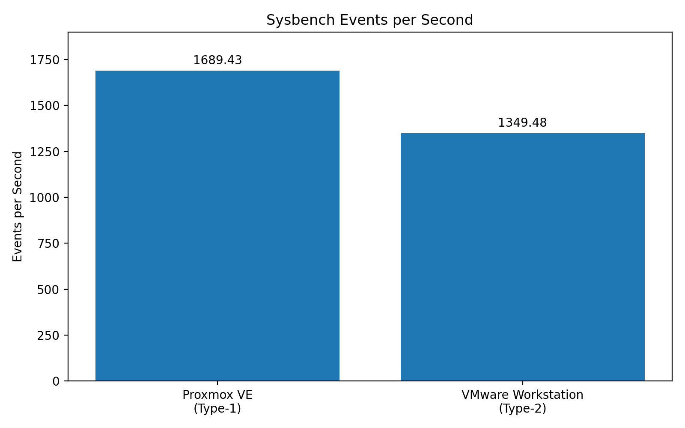
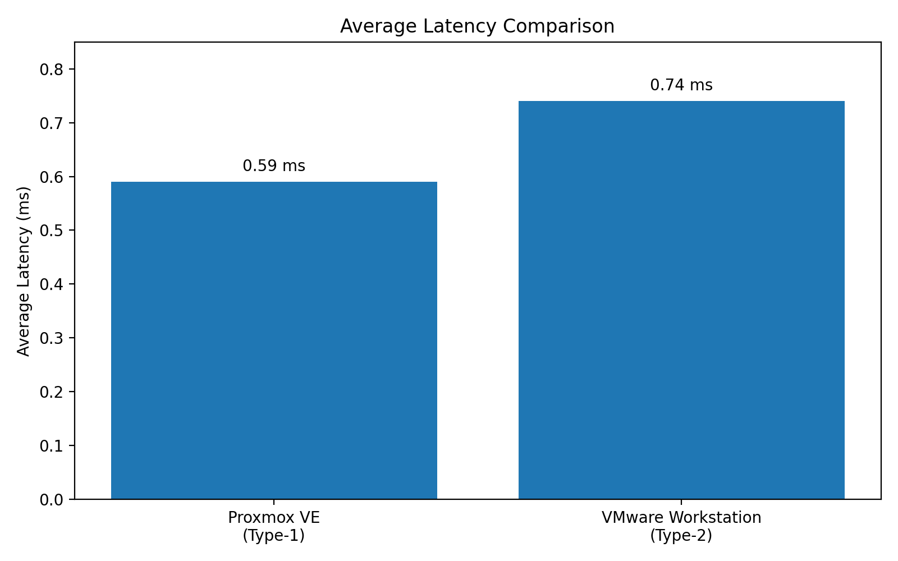
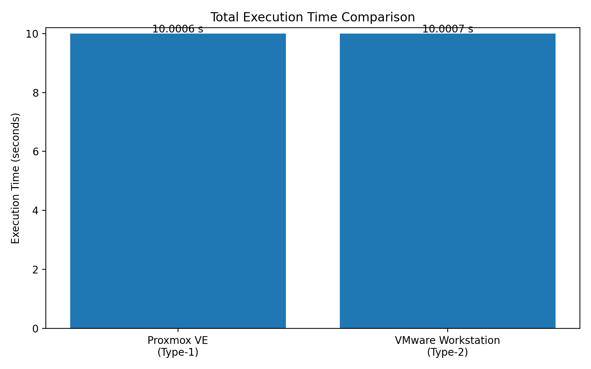
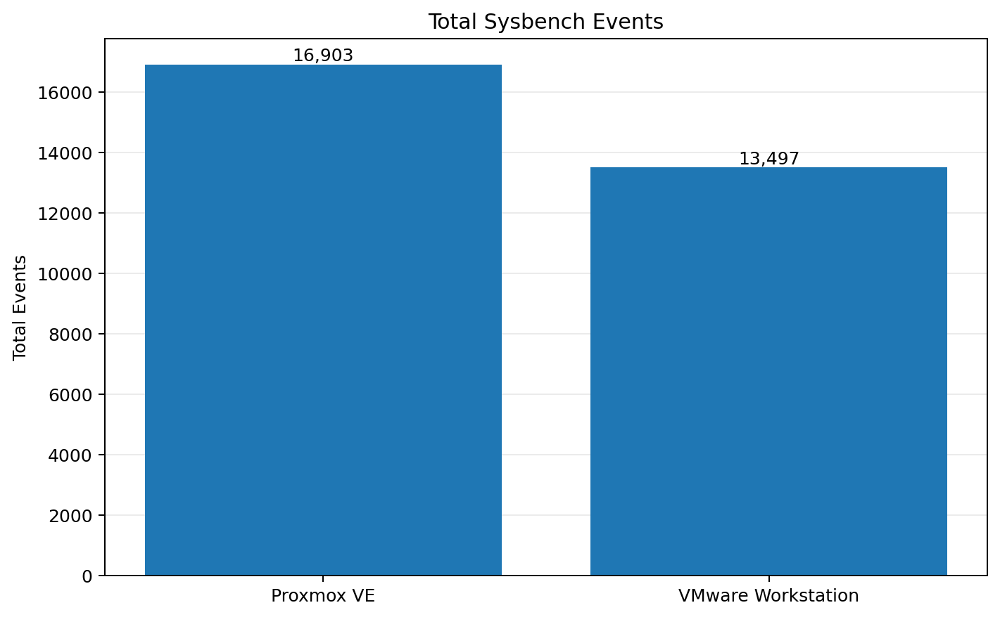

# CC Experiment 01 - Hypervisor Analysis

# Performance Analysis of Type-1 and Type-2 Hypervisors

## Objective

To analyze and compare the performance of **Type-1 and Type-2 hypervisors** by running similarly configured Ubuntu virtual machines and measuring their CPU performance using **Sysbench**.

The hypervisors considered in this experiment are:

- **Type-1 Hypervisor:** Proxmox VE

- **Type-2 Hypervisor:** VMware Workstation

---

# 1. Hypervisor Comparison

| Parameter         | Proxmox VE   | VMware Workstation |
| ----------------- | ------------ | ------------------ |
| Hypervisor Type   | Type-1       | Type-2             |
| Guest OS          | Ubuntu       | Ubuntu             |
| CPU Allocation    | 2 vCPU       | 2 vCPU             |
| Memory Allocation | 2 GB         | 2 GB               |
| Disk Allocation   | 20 GB        | 20 GB              |
| Benchmark         | Sysbench CPU | Sysbench CPU       |

---

# 2. Type-1 Hypervisor – Proxmox VE

Proxmox VE is used as the **Type-1 hypervisor** for this experiment.

## Configuration

| Parameter         | Configuration |
| ----------------- | ------------- |
| Hypervisor        | Proxmox VE    |
| Hypervisor Type   | Type-1        |
| Guest OS          | Ubuntu        |
| CPU Allocation    | 2 vCPU        |
| Memory Allocation | 2 GB          |
| Disk Allocation   | 20 GB         |

## Sysbench Benchmark

The following command was used to perform the CPU benchmark:

```bash
sysbench cpu --cpu-max-prime=20000 run
```

## Result

| Performance Metric   |          Result |
| -------------------- | --------------: |
| Total Execution Time | 10.0006 seconds |
| Total Events         |           16903 |
| Events per Second    |         1689.43 |
| Average Latency      |         0.59 ms |

---

# 3. Type-2 Hypervisor – VMware Workstation

VMware Workstation is used as the **Type-2 hypervisor** for this experiment.

## Configuration

| Parameter         | Configuration      |
| ----------------- | ------------------ |
| Hypervisor        | VMware Workstation |
| Hypervisor Type   | Type-2             |
| Guest OS          | Ubuntu             |
| CPU Allocation    | 2 vCPU             |
| Memory Allocation | 2 GB               |
| Disk Allocation   | 20 GB              |

## Sysbench Benchmark

The same benchmark command was used:

```bash
sysbench cpu --cpu-max-prime=20000 run
```

## Result

| Performance Metric   |          Result |
| -------------------- | --------------: |
| Total Execution Time | 10.0007 seconds |
| Total Events         |           13497 |
| Events per Second    |         1349.48 |
| Average Latency      |         0.74 ms |

---

# 4. Type-1 Hypervisor Workflow

The following workflow was followed for the Proxmox VE virtual machine.

```text
Access Proxmox VE
        ↓
Create Virtual Machine
        ↓
Configure Ubuntu
        ↓
Configure 2 vCPU
        ↓
Configure 2 GB RAM
        ↓
Configure 20 GB Disk
        ↓
Start Virtual Machine
        ↓
Install Ubuntu
        ↓
Verify CPU, Memory and Disk
        ↓
Install Sysbench
        ↓
Run CPU Benchmark
        ↓
Record Results
        ↓
Shut Down VM
```

---

# 5. Type-2 Hypervisor Workflow

The following workflow was followed for the VMware Workstation virtual machine.

```text
Launch VMware Workstation
        ↓
Create New Virtual Machine
        ↓
Select Ubuntu ISO
        ↓
Configure 2 vCPU
        ↓
Configure 2 GB RAM
        ↓
Configure 20 GB Disk
        ↓
Configure Network
        ↓
Start Virtual Machine
        ↓
Install Ubuntu
        ↓
Verify CPU, Memory and Disk
        ↓
Install Sysbench
        ↓
Run CPU Benchmark
        ↓
Record Results
        ↓
Shut Down VM
```

---

# 6. Commands Used

## 6.1 Check System Information

### Check Hostname and Operating System

```bash
hostnamectl
```

### Check CPU Information

```bash
lscpu
```

### Check Memory

```bash
free -h
```

### Check Disk Usage

```bash
df -h
```

### Monitor System Resources

```bash
top
```

---

## 6.2 Install Sysbench

Update the package repository:

```bash
sudo apt update
```

Install Sysbench:

```bash
sudo apt install sysbench -y
```

Check the Sysbench version:

```bash
sysbench --version
```

---

## 6.3 Run CPU Benchmark

The same CPU benchmark was executed on both virtual machines:

```bash
sysbench cpu --cpu-max-prime=20000 run
```

The benchmark uses the same workload for both hypervisors so that their measured CPU performance can be compared.

---

## 6.4 Shut Down the Virtual Machine

After completing the experiment:

```bash
sudo poweroff
```

---

# 7. Performance Comparison

The following results were obtained from the Sysbench CPU benchmark.

| Performance Metric   | Proxmox VE (Type-1) | VMware Workstation (Type-2) |
| -------------------- | ------------------: | --------------------------: |
| Total Execution Time |           10.0006 s |                   10.0007 s |
| Total Events         |               16903 |                       13497 |
| Events per Second    |             1689.43 |                     1349.48 |
| Average Latency      |             0.59 ms |                     0.74 ms |

---

# 8. Performance Graphs

## 8.1 Events per Second

Events per second indicates the number of benchmark events completed per second.



### Observation

- **Proxmox VE:** 1689.43 events/sec

- **VMware Workstation:** 1349.48 events/sec

- **Difference:** 339.95 events/sec

The measured events-per-second value was higher for the Proxmox VE VM in this experiment.

---

## 8.2 Average Latency

Average latency represents the average time taken to complete a benchmark event.



### Observation

- **Proxmox VE:** 0.59 ms

- **VMware Workstation:** 0.74 ms

- **Difference:** 0.15 ms

The measured average latency was lower for the Proxmox VE VM in this experiment.

---

## 8.3 Total Execution Time

This graph compares the total execution time recorded by Sysbench.



### Observation

- **Proxmox VE:** 10.0006 seconds

- **VMware Workstation:** 10.0007 seconds

- **Difference:** 0.0001 seconds

The measured execution times were almost identical.

---

## 8.4 Total Sysbench Events

This graph compares the total number of events completed during the benchmark.



### Observation

- **Proxmox VE:** 16903 events

- **VMware Workstation:** 13497 events

- **Difference:** 3406 events

The Proxmox VE VM completed more benchmark events during the measured test.

---

# 9. Performance Difference

## 9.1 Events per Second

Proxmox VE recorded:

```text
1689.43 events/sec
```

VMware Workstation recorded:

```text
1349.48 events/sec
```

Difference:

```text
1689.43 - 1349.48 = 339.95 events/sec
```

Percentage difference relative to VMware Workstation:

```text
(339.95 / 1349.48) × 100
≈ 25.19%
```

Therefore, the measured events-per-second values differed by approximately **25.19% relative to the VMware Workstation result**.

---

## 9.2 Average Latency

The measured latency values were:

```text
Proxmox VE         → 0.59 ms
VMware Workstation → 0.74 ms
```

Difference:

```text
0.74 - 0.59 = 0.15 ms
```

---

## 9.3 Total Execution Time

The measured execution times were:

```text
Proxmox VE         → 10.0006 seconds
VMware Workstation → 10.0007 seconds
```

Difference:

```text
10.0007 - 10.0006 = 0.0001 seconds
```

The execution times were therefore nearly identical in this experiment.

---

# 10. Performance Analysis

Based on the recorded Sysbench results:

1. Both virtual machines were configured with the same basic resources:
   - 2 vCPU

   - 2 GB RAM

   - 20 GB disk

   - Ubuntu guest operating system

2. The same Sysbench CPU benchmark was executed on both virtual machines.

3. Proxmox VE recorded **1689.43 events/sec**.

4. VMware Workstation recorded **1349.48 events/sec**.

5. The difference between the measured events-per-second values was **339.95 events/sec**.

6. The average latency measured for Proxmox VE was **0.59 ms**.

7. The average latency measured for VMware Workstation was **0.74 ms**.

8. The total execution times were almost identical:
   - Proxmox VE: **10.0006 seconds**

   - VMware Workstation: **10.0007 seconds**

These results represent the performance observed under the specific experimental configuration and system conditions used during the test.

---

# 11. Final Results

| Metric               | Proxmox VE | VMware Workstation |
| -------------------- | ---------: | -----------------: |
| Hypervisor Type      |     Type-1 |             Type-2 |
| Guest OS             |     Ubuntu |             Ubuntu |
| CPU                  |     2 vCPU |             2 vCPU |
| Memory               |       2 GB |               2 GB |
| Disk                 |      20 GB |              20 GB |
| Total Execution Time |  10.0006 s |          10.0007 s |
| Total Events         |      16903 |              13497 |
| Events per Second    |    1689.43 |            1349.48 |
| Average Latency      |    0.59 ms |            0.74 ms |

---

# 12. Conclusion

The experiment analyzed and compared the CPU performance of a **Type-1 hypervisor, Proxmox VE**, and a **Type-2 hypervisor, VMware Workstation**.

Both virtual machines were configured with **2 vCPU, 2 GB RAM, and 20 GB disk** and used Ubuntu as the guest operating system.

The same Sysbench CPU benchmark was executed on both systems:

```bash
sysbench cpu --cpu-max-prime=20000 run
```

The measured results were:

```text
Proxmox VE

Events/sec     : 1689.43
Latency        : 0.59 ms
Execution Time : 10.0006 s

VMware

Events/sec     : 1349.48
Latency        : 0.74 ms
Execution Time : 10.0007 s
```

In this particular experiment, the Proxmox VE VM recorded a higher events-per-second value and a lower average latency, while the total execution times were nearly identical.

The experiment demonstrates how **Sysbench can be used to measure and compare CPU performance in virtualized environments**.

---

# 13. Experiment Summary

| Item              | Details                                  |
| ----------------- | ---------------------------------------- |
| Experiment        | Hypervisor Performance Analysis          |
| Type-1 Hypervisor | Proxmox VE                               |
| Type-2 Hypervisor | VMware Workstation                       |
| Guest OS          | Ubuntu                                   |
| CPU Allocation    | 2 vCPU                                   |
| Memory Allocation | 2 GB                                     |
| Disk Allocation   | 20 GB                                    |
| Benchmark Tool    | Sysbench                                 |
| CPU Benchmark     | `sysbench cpu --cpu-max-prime=20000 run` |
| Main Metric       | Events per Second                        |
| Type-1 Result     | 1689.43 events/sec                       |
| Type-2 Result     | 1349.48 events/sec                       |

```

This version is based directly on your provided README content; the graph syntax and section numbering are the only substantive corrections.
```
